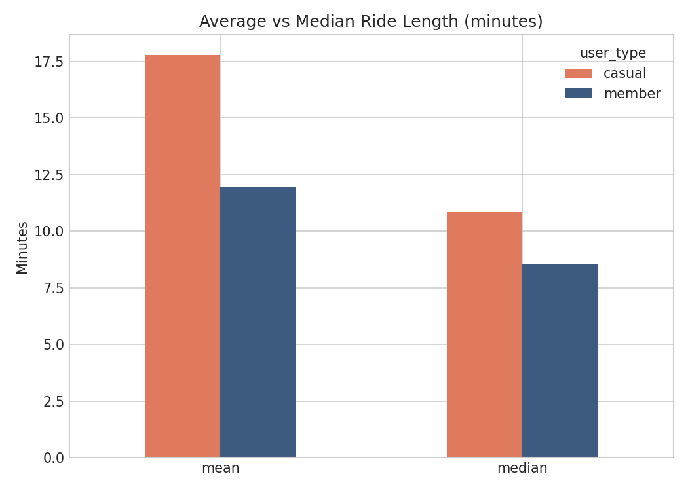
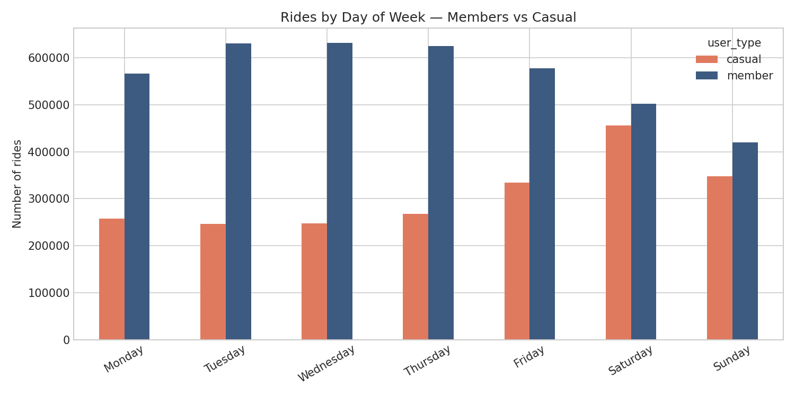
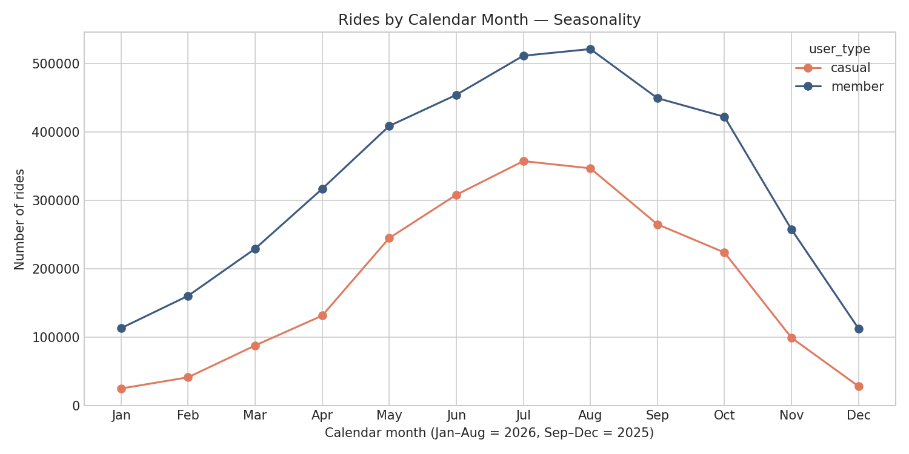
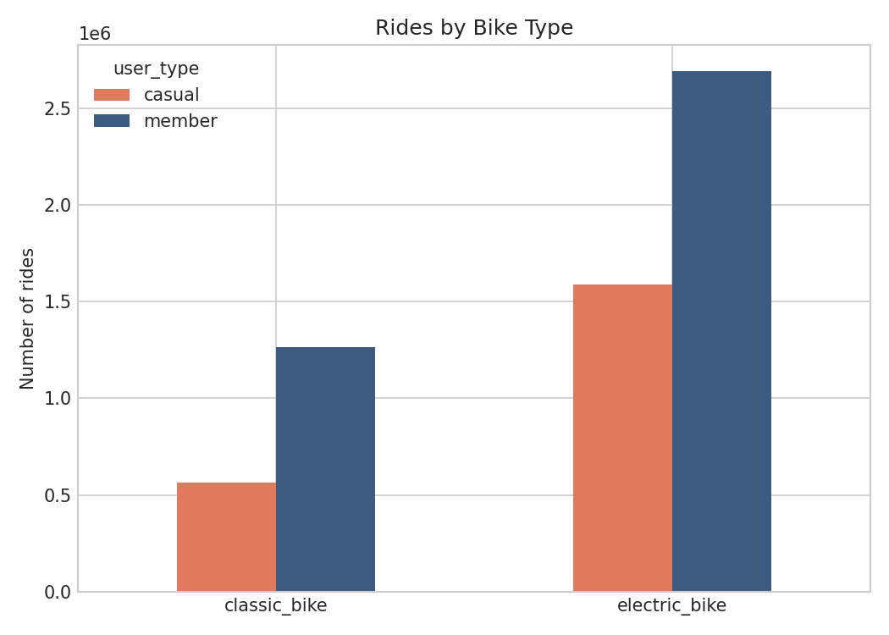

# Divvy Bike-Share Case Study
## How do annual members and casual riders use Divvy differently?

### 1. Business Question
Divvy (Chicago) wants to convert casual riders into annual members.
This analysis identifies how the two groups behave differently, to
ground a marketing strategy in evidence.

### 2. Data
Twelve months of trip data (September 2025 - August 2026), 6,110,615
rides after cleaning. Source: public Divvy tripdata. Cleaning rules and
two data-quality defects (a mislabeled January file; 28 cross-month
duplicate ride_ids) are documented in CLEANING_LOG.md. Verification:
zero negative durations, zero rides >= 24h, zero duplicates, zero
missing user types.

### 3. Findings

**Volume and duration.** Members made 3.95 million rides averaging
12.0 minutes (median 8.6). Casual riders made 2.16 million rides
averaging 17.8 minutes (median 10.8). Casual rides are about 50%
longer, but casual riders ride less than half as often.

**Weekly rhythm.** The two groups ride on different days. Members peak
midweek (16.0% of their rides on Wednesday and Thursday) and dip on
weekends. Casual riders peak on Sunday (21.1% of their rides) and
Saturday (15.5%) - a clear leisure signature.

**Seasonality.** Casual demand swings 14-fold between January (24,656
rides) and July (357,121); member demand swings less than 5-fold
(112,933 to 520,962). Even casual ride length is seasonal: 19.0 minutes
on average in May versus 12.5 in December.

**Bike type.** Both groups prefer electric bikes - 73.7% of casual
rides and 68.1% of member rides.

### 4. Recommendations
1. Target casual riders on weekends, where their demand concentrates.
2. Time the campaign for spring, at the start of the casual riding
   season.
3. Pitch the economics of frequent leisure use: translate a casual
   rider's own usage into a per-ride versus membership comparison.

### 5. Limitations
One year of data (no year-over-year comparison); no demographic,
payment, or location-of-residence information; ride length capped at
24 hours during cleaning; monthly seasonality shown by calendar month
(months 1-8 from 2026, 9-12 from 2025).

---
Tools: Python, pandas, matplotlib, Jupyter. Full pipeline reproducible
from the notebook; summary tables in analysis/.
